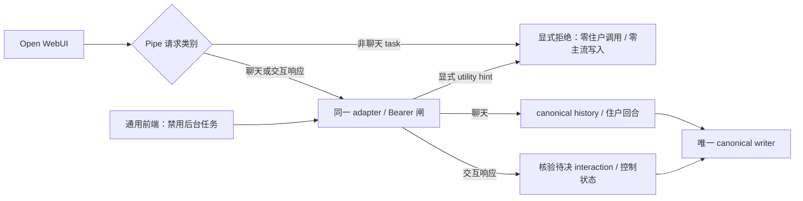

# OpenAI-compatible 前端适配层（D31）

状态：**图纸候选，先供主笔评审；功能驱动尚未落地，FE-01～FE-07 应保持全红。**

关联：D31 / #218；D9 一窗流；D11 第二、三、四条；#49 鉴权；D30 删除旧 DSH webui。

## 0. 一句话

mist 开一个 OpenAI-compatible 的对话口子，但只借它的请求/响应外壳：住户、scope、历史、
主流、附件与阻断状态仍由 mist 掌权。前端传来的 `model`、会话列表和重放历史都不能反客为主。

## 1. 权威边界

一份 adapter binding 在宿主侧固定绑定：

```text
Bearer token ref
  → residentId
  → scopeId
  → canonical streamId
  → server-owned model route
```

客户端不能用下面任何字段改变这条绑定：

- `model`
- `user`
- 前端自己的 conversation/chat/session id
- `metadata`
- 请求中较早的 `system` / `developer` / `assistant` / `tool` / `user` messages

这些字段可以为兼容而出现，但不拥有身份、scope、模型路由或历史权威。服务端响应里的 `model`
也必须回 server-owned route，不能照抄客户端输入制造「真的切了模型」的假象。

**代价**：Open WebUI 等前端仍会显示自己的会话列表和 model selector，但它们只是本地界面状态。
同一 token 下开多少个前端会话，都落到同一位住户、同一 scope、同一条主流；界面和底层语义
会有意不完全一致。

## 2. 兼容端点

### `POST /v1/chat/completions`

这是 FE-02 的必需对话口子。鉴权之后先区分普通聊天、显式 utility task 与 interaction response。
普通聊天请求可带完整 `messages`，但 adapter 只消费**数组最后一项、且该项必须是
`role: "user"`**，作为本次新 turn。最后一项不是 user、messages 为空、或当前 user content
无法解析时，返回 OpenAI 风格错误包，code 为 `MIST_INVALID_TURN_SHAPE`。
utility task 与 interaction response 都不能借这个形状被自动解释成一条新用户话语。

最后一项之前的所有 messages：

- 不进模型；
- 不进 canonical stream；
- 不进日志、诊断导出或失败回执正文；
- 不用于判断「前面聊过什么」。

模型上下文由 canonical stream 现读现装，再接本次新 turn。adapter 不做客户端历史与主流的
「智能合并」，也不因它们看起来一致就放行。

**代价**：部分前端习惯靠重放 history 接无状态模型；在 mist 这里，这些字节会被刻意丢弃。
前端里删除、编辑或 fork 某条旧消息也不会改写住户历史。

### `GET /v1/models`

在禁用本节下述后台任务后，OpenAI-compatible client 可不经 Pipe Function 直接接 FE-02；
为减少手填 model id，功能实现宜提供
同一 Bearer 闸后的 model discovery。它最多暴露当前 binding 的一个 server-owned model id，不能
列出住户名、scope、provider 凭证或其他 binding。请求里的 `model` 仍不取得路由权。

这不是第八盏灯：Open WebUI 可以通过 allowlist 或 Pipe Function 指定 model id，现有 FE-02 也不以
`/v1/models` 是否存在申绿。若主笔决定把 discovery 升成必需面，应在写功能前把它加进 FE-02
驱动，而不是实现后补测试。

### 前端后台任务不进主流

Open WebUI 默认把标题、tags、follow-up 等后台任务交给当前聊天模型；标题请求本身也是一个
`role: "user"` completion。只丢弃前缀 history 不能识别它，切换请求里的 `model` 也不能隔离它：
同一 binding 的 server-owned route 不随客户端字段改变。

本候选不提供第二条 utility 模型路由。接入要同时守住两个边界：

- `/webui` 安装配置禁用会发往 Mist 的标题、tags、follow-up、autocomplete、检索/搜索 query
  rewriting、image prompt 与前端 context compaction 等后台调用；Pipe 对 `__task__` 标识的
  非聊天请求直接返回 `MIST_UTILITY_REQUEST_UNSUPPORTED`，不转发给住户。
- 通用客户端也须禁用这些调用，或显式配置一个独立 provider 承担它们。不能只在同一个 Mist
  endpoint 下换 task model 名字。adapter 收到显式 utility task hint 时同样拒绝，不读主流、
  不调模型、不写 canonical event 或附件。

task hint 是客户端声明，只能使请求被拒绝，不能授予身份、scope、模型路由或运行权限。
线协议使用 `mist.task_kind`（driver 归一化为 `taskKind`）；非空字符串表示 utility task，
例如 `"title_generation"`。缺失或空串不作 utility 声明。它不是 OpenAI 标准字段。
未声明的普通 user 请求与未标记的 utility prompt 无法可靠区分；adapter 不靠 prompt 关键词猜。
因此，正确的前端配置是 generic 接入的前提，不把它包装成服务端已经证明的用户意图。



**代价**：接 Mist 的 Open WebUI 默认没有模型自动起标题、标签和 follow-up；想保留这些体验，
用户要另配独立 provider。没有 task hint 的通用客户端不能由服务端自动排除后台 prompt。
这项限制必须进入对接说明，不能等主流被污染后再提醒。

## 3. 普通消息

普通 user turn 使用标准形状：

```json
{
  "model": "任意兼容占位值",
  "messages": [
    { "role": "user", "content": "今天发生了什么？" }
  ],
  "stream": false
}
```

普通回复保持 Chat Completions 可读形状；FE-02 同时冻结非流式与 SSE 流式投影。两种投影都必须
来自同一回合结果：流式 chunks 拼回的正文与非流式完整正文一致，canonical writer 只落一次
user event 与一次 assistant event，不能一边 streaming 一边重复写账。

响应的 mist 扩展只加信息，不改普通 OpenAI 客户端需要的主干字段：

```json
{
  "id": "chatcmpl_mist_...",
  "object": "chat.completion",
  "created": 1791061200,
  "model": "mist:<server-route>",
  "choices": [{
    "index": 0,
    "message": { "role": "assistant", "content": "..." },
    "finish_reason": "stop"
  }],
  "mist": {
    "stream_id": "...",
    "attachments": [],
    "interaction": null,
    "projection": {
      "status": "native",
      "missing_capabilities": [],
      "canonical_event_ids": ["..."]
    }
  }
}
```

未知扩展字段会被普通客户端忽略；Open WebUI Pipe Function 可以读取完整 `mist` 段。

SSE 使用 `data: <JSON>` 帧；数据对象为 `chat.completion.chunk`，共享同一 id 与 server-owned
model，经 `choices[0].delta` 发出 assistant role 和 content，结束帧给 `finish_reason: "stop"`，
最后恰好一个 `data: [DONE]`。流中也要保留附件、interaction 与 projection 扩展，不能只让
非流式路径拥有结构。公开 CI 可以用合成 transport 返回原始字节；判卷先核原始 JSON/SSE，
再比其正文与结构化扩展是否和归一化观察值一致，不能让 driver 用私有形状替换损坏的 wire。

**代价**：driver 多一个原始 transport 观察面，fixture 也必须产出真实协议形状；代价换来的是
判卷能够拒绝“内部往返成功、普通前端却读不懂”的 serializer。

## 4. 附件

### 4.1 入站

当前 user message 的 `content` 可以是 content-part 数组：

- `{ "type": "text", "text": "..." }`
- `{ "type": "file", "file": { "filename", "file_data" | "file_id" } }`
- `{ "type": "image_url", "image_url": { "url" } }`

v0 只允许两种字节来源：

1. inline data（经大小、媒体类型与内容校验后写入私有附件面）；
2. 宿主签发的 opaque attachment ref。

任意 `http://` / `https://` URL 不由 adapter 代抓，避免把 OpenAI-compatible 入口变成 SSRF 下载器。
远程 URL 如以后要支持，另立凭证、网络政策和真实回执，不在这张图纸里暗开。

模型与 canonical stream 只拿结构化附件引用；base64、浏览器 object URL、前端本地路径和 provider
URL 不落消息正文。

### 4.2 出站

assistant 侧附件放在 `mist.attachments[]`，每项至少包含：

```json
{
  "attachment_id": "opaque-id",
  "kind": "image | file",
  "filename": "name.ext",
  "media_type": "...",
  "size_bytes": 123,
  "source": "inline | opaque-ref"
}
```

附件不是 markdown 假链接、`[attachment]` 文本标记或内联 base64。client 声明 `attachments`
capability 时，adapter 选择 native projection；未声明时仍保留结构化对象，并把
`projection.status` 设为 `degraded`、`missing_capabilities` 写入 `attachments`。正文只能给出诚实的
可见性说明，不能把附件内容伪装成已呈现。

## 5. 选项、批准与阻断

它们不冒充 model tool call。tool call 表示模型要调用函数；这里表达的是宿主/用户界面的
控制状态，混用会让通用客户端误执行或伪造完成。

结构固定在 `mist.interaction`：

```json
{
  "interaction_id": "...",
  "kind": "choice | approval | blocked",
  "prompt": "...",
  "blocking": true,
  "options": [
    { "option_id": "...", "label": "...", "description": null }
  ],
  "reason_code": null
}
```

支持交互的 Pipe Function 用请求扩展提交控制响应，`messages` 为空即可；不要求为点击捏造一个
user turn，也不消费客户端重放的 history：

```json
{
  "model": "任意兼容占位值",
  "stream": false,
  "messages": [],
  "mist": {
    "interaction_response": {
      "interaction_id": "...",
      "option_id": "..."
    }
  }
}
```

服务端按 interaction id、现行住户/scope、未解决状态与 option id 逐项核验。普通 user 文本永远
不能被猜成「点了某个按钮」。

choice 与 approval 的 native 路径都必须可完成：未解决状态保留原始 prompt、kind、blocking、
option id/label/description 与 reason code；合法控制响应只解决对应 binding 的待决项，恰好
记录一次可归属的控制结果，保留 interaction id 与被选中的 option id，不作为普通
user/assistant 对话调用模型。已解决项不可再次消费。
错误 interaction id、错误 option、跨 binding/scope 响应与重复响应均拒绝，控制状态与模型、
canonical 写入不增加。普通聊天文字可以继续成为聊天，但待决 blocking 动作不能因此解除，
也不能把文字猜成点击。
判卷须读回 pending/resolved 状态与实际选择，不能只看一份返回对象自称成功。
上述控制拒绝使用稳定 code `MIST_INTERACTION_RESPONSE_INVALID`。合法结果的 canonical 事件
保留完整 interaction 和选中 option；driver 的 `resolvedOptionId` 与耐久状态的
`resolutionEventId` 对应同一次追加，不能多写、错户或只在响应中自称解决。

不声明 `interactions` capability 的通用前端仍收到结构化 interaction，但
`projection.status = "blocked"`。普通正文只说明当前 surface 无法完成这项控制，不列出可复制粘贴
的编号选项，不接受自然语言替代点击。用户可换到终端或支持 Pipe Function 的前端继续。

**代价**：纯 OpenAI 通用客户端可以聊天，却可能在批准/选择点停住。这比把高权限动作降成一行
可伪造文本更诚实。

## 6. 前端能力、投影决策与证据边界

请求扩展可声明：

```json
{
  "mist": {
    "client": {
      "surface": "open-webui-pipe-function",
      "capabilities": ["attachments", "interactions"]
    }
  }
}
```

声明只影响呈现，不参与鉴权或授权；它也是 client claim，不是宿主已经验证过的 UI 能力。未声明
时按 generic text-only surface 处理。

adapter 在组装本轮模型输入时，加入「本轮 client 声明了哪些 capability」这一宿主事实；回复
提交后，把 `native / degraded / blocked` 与缺失 capability 作为**服务端投影决策**关联到本轮
canonical 事件。下一轮住户可以知道 adapter 当时采取了哪种投影、为什么降级或阻断，不必从
前端重放历史里猜。

这条记录**不能证明浏览器最终真的渲染成功**。Chat Completions 响应没有客户端确认通道；把
capability claim 或「响应已经写出 socket」叫成 UI delivery receipt，会越过实际证据。若以后
Open WebUI Pipe Function 要回传真实呈现结果，必须另立带 request/event id 的 acknowledgment，
与当前 `projection` 对象和 `surface-projection` 事件分开。图纸候选统一使用投影命名，
不保留没有实际调用方的早期回执别名。它不是用户话语，也不拼进 assistant 正文。

## 7. 鉴权、网络与错误

每次请求都必须带 `Authorization: Bearer <token>`。loopback 不豁免；缺 token 与错 token 均在
解析消息、读取主流、调用模型之前拒绝。失败后模型调用数、canonical event 数和附件写入数均为零。

生产 listener 默认只绑定 loopback；改为非 loopback 必须显式配置，并先登记进
`docs/runtime-config.md`。CORS 默认不开 wildcard，token 不进 query string。请求体、附件与并发
必须有上限；这些是第一处网络入口的实现约束，不因公开 CI 使用合成 transport 而消失。

错误保持 OpenAI 风格 envelope，并有稳定 code：

```json
{
  "error": {
    "type": "mist_auth_error",
    "code": "AUTH_REQUIRED",
    "message": "...",
    "param": null
  }
}
```

token 原文不进日志、投影记录、响应 id/body/error、原始 JSON/SSE、诊断导出或错误 message。
判卷同时扫描普通及 SSE 成功响应、401 原始响应、模型与 canonical/交互/附件元数据读回和审计；
失败诊断同样不打印已发现的 token。raw transport 的请求观察只保留 body，不复制 Authorization。
鉴权审计只记请求 id、来源类别、结果 code 与时间。带附件的未认证请求也必须先拒绝，
附件私有面不能先落字节再靠 canonical event 数为零冒充“零副作用”。

## 8. `/webui` 的接缝

`/webui` 是后续施工，不在 adapter PR1 里偷跑。它必须：

1. 先展示要安装的 Open WebUI、资源占用与将启动的服务，等待主人确认；
2. 检查 Docker 或 Python，二者都没有时只说明缺项，不安装系统运行时；
3. 走现有 `frontend` 插件安装闸；
4. 启动后打印本机 URL；
5. Open WebUI 的 **Pipe Function** 连接本图纸同一个 endpoint，不另开 history、auth 或 writer 后门。
6. 应用本图纸的后台任务禁用配置；Pipe 对残留的非聊天 task 显式拒绝。

这里说的是 Open WebUI 当前的 in-process Pipe Function，不是已经标为 legacy 的独立 Pipelines
服务。generic OpenAI-compatible client 不需要安装这段专用代码，但也拿不到完整可点击交互。
FE-07 要从这条实际接线读回回复与精确事件数，核 writer、resident、scope、stream，复验缺 token
与伪造 history 的拒绝/丢弃，不只比较 endpoint 标签或“文字出现在某处”。

## 9. 可执行判卷映射

| 灯 | 本图纸冻结的观察面 |
| --- | --- |
| FE-01 | terminal 默认、external 显式、legacy official-skin 可操作拒绝且原字节不改 |
| FE-02 | 原始 JSON/SSE 与归一化结果相符、唯一 writer、每个 turn 恰好一份、utility 拒绝 |
| FE-03 | 请求前缀历史不进模型、不落账，末尾 user turn 才是本次输入 |
| FE-04 | model/user/conversation id 不改变 resident/scope/stream/server route |
| FE-05 | 完整附件/interaction 结构、generic 降级、native choice/approval 控制闭环与负例 |
| FE-06 | 同一 Bearer 闸、失败零模型/账/附件副作用、响应与读回全表面 token 零泄漏 |
| FE-07 | 确认、环境、插件闸、本机 URL、同 endpoint 的 writer/history/auth 边界与 task 拒绝 |

判卷驱动只观察公开边界；缺驱动时七盏全红。正向 fixture 只用于证明判卷器能识别正确形状，
不替代真实 adapter、真实宿主或独立验收席。
具体 typed 观察口见 [driver contract](../../acceptance/frontend-adapter-driver.ts)：
`readRawWire` 保留实际请求/响应 body，包含被拒绝的响应；`readInteractions` 读回待决与解决状态；
`readAttachmentWrites` 单独读回附件私有面的写入计数与 opaque 元数据，不导出附件字节。
后者是鉴权/utility 拒绝零附件副作用的证据，不能由 canonical event 数或没有模型调用替代。

## 10. 协议依据

2026-10-04 查阅：[Chat Completions 与 streaming chunk 对象](https://developers.openai.com/api/reference/resources/chat)、
[Open WebUI Task Models](https://docs.openwebui.com/features/administration/task-models/)、
[Pipe Function 保留参数](https://docs.openwebui.com/features/extensibility/plugin/functions/pipe/)。
这些资料说明第三方协议与后台任务行为，不替代主笔对本图纸的评审或真实 Open WebUI 验证。
